# 🐍 Python API Reference - JAEGIS AI Web OS

## 📋 **Overview**

The JAEGIS AI Web OS Python API provides programmatic access to all core functionality, enabling seamless integration into existing workflows, CI/CD pipelines, and custom applications.

---

## 🚀 **Installation**

```bash
# Install via pip
pip install jaegis-ai-web-os

# Install with development dependencies
pip install jaegis-ai-web-os[dev]

# Install from source
git clone https://github.com/usemanusai/JAEGIS-AI-Web-OS.git
cd JAEGIS-AI-Web-OS
pip install -e .
```

---

## 🏗️ **Core API Architecture**

```mermaid
graph TB
    subgraph PythonAPI["Python API Layer"]
        CLIENT["🐍 JAEGISClient"]
        BUILDER["🏗️ ProjectBuilder"]
        PROCESSOR["📄 DocumentProcessor"]
        CACHE["🗄️ CacheManager"]
    end
    
    subgraph CoreServices["Core Services"]
        AI["🤖 AIProviderManager"]
        TEMPLATE["📋 TemplateEngine"]
        VALIDATOR["✅ BuildValidator"]
    end
    
    subgraph ExternalIntegrations["External Integrations"]
        OPENAI["🚀 OpenAI API"]
        ANTHROPIC["🧠 Anthropic API"]
        REDIS["🗄️ Redis Cache"]
        FILESYSTEM["📁 File System"]
    end
    
    CLIENT --> BUILDER
    CLIENT --> PROCESSOR
    CLIENT --> CACHE
    
    BUILDER --> AI
    BUILDER --> TEMPLATE
    BUILDER --> VALIDATOR
    
    PROCESSOR --> AI
    AI --> OPENAI
    AI --> ANTHROPIC
    
    CACHE --> REDIS
    BUILDER --> FILESYSTEM
    
    classDef apiStyle fill:#e1f5fe,stroke:#01579b,stroke-width:2px
    classDef coreStyle fill:#f3e5f5,stroke:#7b1fa2,stroke-width:2px
    classDef externalStyle fill:#fff3e0,stroke:#f57c00,stroke-width:2px
    
    class PythonAPI apiStyle
    class CoreServices coreStyle
    class ExternalIntegrations externalStyle
```



---

## 🎯 **Quick Start Example**

```python
from jaegis_ai_web_os import JAEGISClient
import asyncio

async def main():
    # Initialize client with configuration
    client = JAEGISClient(
        ai_provider="openai",
        api_key="your-openai-key",
        cache_enabled=True,
        redis_url="redis://localhost:6379"
    )
    
    # Build project from document
    result = await client.build_project(
        base_document="./architecture.docx",
        output_directory="./generated-app",
        template_preference="nextjs",
        enhanced_mode=True
    )
    
    print(f"✅ Project generated: {result.output_path}")
    print(f"📊 Files created: {result.files_count}")
    print(f"⏱️ Generation time: {result.duration}s")

# Run the example
asyncio.run(main())
```

---

## 📚 **Core Classes**

### **JAEGISClient**

The main entry point for all JAEGIS operations.

```python
class JAEGISClient:
    """Main client for JAEGIS AI Web OS operations."""
    
    def __init__(
        self,
        ai_provider: str = "openai",
        api_key: Optional[str] = None,
        cache_enabled: bool = True,
        redis_url: Optional[str] = None,
        config_file: Optional[str] = None
    ):
        """
        Initialize JAEGIS client.
        
        Args:
            ai_provider: AI provider to use ("openai", "anthropic", "azure")
            api_key: API key for the AI provider
            cache_enabled: Enable Redis caching
            redis_url: Redis connection URL
            config_file: Path to configuration file
        """
```

#### **Methods**

##### **build_project()**
```python
async def build_project(
    self,
    base_document: str,
    output_directory: str,
    template_preference: Optional[str] = None,
    enhanced_mode: bool = False,
    dry_run: bool = False,
    **kwargs
) -> BuildResult:
    """
    Build a complete project from architectural documentation.
    
    Args:
        base_document: Path to the source document
        output_directory: Where to generate the project
        template_preference: Preferred template ("nextjs", "react", "python", etc.)
        enhanced_mode: Enable AI-enhanced generation
        dry_run: Preview changes without execution
        
    Returns:
        BuildResult: Detailed results of the build process
        
    Raises:
        DocumentProcessingError: If document cannot be processed
        AIProviderError: If AI provider fails
        BuildValidationError: If generated project fails validation
    """
```

##### **process_document()**
```python
async def process_document(
    self,
    document_path: str,
    chunk_size: int = 4000,
    overlap_size: int = 200,
    extract_entities: bool = True
) -> DocumentAnalysis:
    """
    Process and analyze a document without generating code.
    
    Args:
        document_path: Path to the document to process
        chunk_size: Size of text chunks for processing
        overlap_size: Overlap between chunks
        extract_entities: Extract architectural entities
        
    Returns:
        DocumentAnalysis: Detailed analysis results
    """
```

##### **list_templates()**
```python
def list_templates(self) -> List[TemplateInfo]:
    """
    Get available project templates.
    
    Returns:
        List[TemplateInfo]: Available templates with metadata
    """
```

##### **validate_project()**
```python
async def validate_project(
    self,
    project_path: str,
    run_tests: bool = True,
    check_dependencies: bool = True
) -> ValidationResult:
    """
    Validate a generated project.
    
    Args:
        project_path: Path to the project to validate
        run_tests: Execute project tests
        check_dependencies: Verify dependency compatibility
        
    Returns:
        ValidationResult: Validation results and recommendations
    """
```

---

### **DocumentProcessor**

Handles document parsing and analysis.

```python
class DocumentProcessor:
    """Advanced document processing with multi-format support."""
    
    def __init__(
        self,
        supported_formats: List[str] = None,
        max_file_size: int = 100 * 1024 * 1024,  # 100MB
        parallel_processing: bool = True
    ):
        """
        Initialize document processor.
        
        Args:
            supported_formats: List of supported file extensions
            max_file_size: Maximum file size in bytes
            parallel_processing: Enable parallel chunk processing
        """
```

#### **Methods**

##### **process_file()**
```python
async def process_file(
    self,
    file_path: str,
    preserve_structure: bool = True,
    extract_metadata: bool = True
) -> ProcessedDocument:
    """
    Process a single document file.
    
    Args:
        file_path: Path to the document
        preserve_structure: Maintain document structure
        extract_metadata: Extract document metadata
        
    Returns:
        ProcessedDocument: Processed document with content and metadata
    """
```

##### **chunk_content()**
```python
def chunk_content(
    self,
    content: str,
    chunk_size: int = 4000,
    overlap_size: int = 200,
    preserve_sentences: bool = True
) -> List[TextChunk]:
    """
    Split content into semantic chunks.
    
    Args:
        content: Text content to chunk
        chunk_size: Maximum chunk size in characters
        overlap_size: Overlap between chunks
        preserve_sentences: Avoid breaking sentences
        
    Returns:
        List[TextChunk]: List of text chunks with metadata
    """
```

---

### **ProjectBuilder**

Handles project generation and template management.

```python
class ProjectBuilder:
    """Intelligent project builder with template system."""
    
    def __init__(
        self,
        template_directory: Optional[str] = None,
        ai_provider: Optional[AIProviderManager] = None,
        cache_manager: Optional[CacheManager] = None
    ):
        """
        Initialize project builder.
        
        Args:
            template_directory: Custom template directory
            ai_provider: AI provider for enhanced generation
            cache_manager: Cache manager for performance
        """
```

#### **Methods**

##### **generate_project()**
```python
async def generate_project(
    self,
    analysis: DocumentAnalysis,
    template_name: str,
    output_path: str,
    enhanced_mode: bool = False,
    custom_prompts: Optional[Dict[str, str]] = None
) -> GenerationResult:
    """
    Generate a complete project from document analysis.
    
    Args:
        analysis: Document analysis results
        template_name: Template to use for generation
        output_path: Where to generate the project
        enhanced_mode: Use AI for enhanced generation
        custom_prompts: Custom prompts for AI generation
        
    Returns:
        GenerationResult: Generation results and metadata
    """
```

##### **apply_template()**
```python
def apply_template(
    self,
    template_name: str,
    context: Dict[str, Any],
    output_path: str
) -> TemplateResult:
    """
    Apply a template with given context.
    
    Args:
        template_name: Name of the template to apply
        context: Template context variables
        output_path: Output directory
        
    Returns:
        TemplateResult: Template application results
    """
```

---

### **AIProviderManager**

Manages multiple AI providers with intelligent fallbacks.

```python
class AIProviderManager:
    """Multi-provider AI integration with intelligent fallbacks."""
    
    def __init__(
        self,
        primary_provider: str = "openai",
        fallback_providers: List[str] = None,
        retry_attempts: int = 3,
        timeout: int = 120
    ):
        """
        Initialize AI provider manager.
        
        Args:
            primary_provider: Primary AI provider
            fallback_providers: List of fallback providers
            retry_attempts: Number of retry attempts
            timeout: Request timeout in seconds
        """
```

#### **Methods**

##### **generate_response()**
```python
async def generate_response(
    self,
    prompt: str,
    provider: Optional[str] = None,
    model: Optional[str] = None,
    temperature: float = 0.7,
    max_tokens: Optional[int] = None
) -> AIResponse:
    """
    Generate AI response with automatic fallbacks.
    
    Args:
        prompt: Input prompt for the AI
        provider: Specific provider to use
        model: Specific model to use
        temperature: Response creativity (0.0-1.0)
        max_tokens: Maximum response length
        
    Returns:
        AIResponse: AI response with metadata
    """
```

##### **analyze_architecture()**
```python
async def analyze_architecture(
    self,
    document_content: str,
    analysis_type: str = "comprehensive"
) -> ArchitectureAnalysis:
    """
    Analyze architectural content using AI.
    
    Args:
        document_content: Document content to analyze
        analysis_type: Type of analysis ("comprehensive", "quick", "detailed")
        
    Returns:
        ArchitectureAnalysis: Detailed architecture analysis
    """
```

---

## 📊 **Data Models**

### **BuildResult**
```python
@dataclass
class BuildResult:
    """Results from a project build operation."""
    
    success: bool
    output_path: str
    files_count: int
    lines_of_code: int
    duration: float
    template_used: str
    ai_provider_used: str
    cache_hits: int
    errors: List[str]
    warnings: List[str]
    metadata: Dict[str, Any]
```

### **DocumentAnalysis**
```python
@dataclass
class DocumentAnalysis:
    """Results from document analysis."""
    
    file_path: str
    file_type: str
    content_length: int
    chunks: List[TextChunk]
    entities: List[Entity]
    technologies: List[str]
    frameworks: List[str]
    dependencies: List[str]
    architecture_patterns: List[str]
    metadata: Dict[str, Any]
    processing_time: float
```

### **ValidationResult**
```python
@dataclass
class ValidationResult:
    """Results from project validation."""
    
    valid: bool
    syntax_errors: List[str]
    dependency_issues: List[str]
    test_results: Optional[TestResults]
    build_success: bool
    recommendations: List[str]
    quality_score: float
    performance_metrics: Dict[str, Any]
```

---

## ⚙️ **Configuration**

### **Environment Variables**
```python
import os
from jaegis_ai_web_os import JAEGISClient

# Configure via environment variables
os.environ["JAEGIS_AI_PROVIDER"] = "openai"
os.environ["JAEGIS_OPENAI_API_KEY"] = "your-api-key"
os.environ["JAEGIS_REDIS_URL"] = "redis://localhost:6379"
os.environ["JAEGIS_CACHE_ENABLED"] = "true"
os.environ["JAEGIS_LOG_LEVEL"] = "INFO"

# Client will automatically use environment variables
client = JAEGISClient()
```

### **Configuration File**
```python
# Load from YAML configuration
client = JAEGISClient(config_file="./jaegis_config.yaml")

# Load from dictionary
config = {
    "ai": {
        "provider": "openai",
        "api_key": "your-api-key",
        "fallback_providers": ["anthropic", "azure"]
    },
    "cache": {
        "enabled": True,
        "redis_url": "redis://localhost:6379",
        "ttl": {
            "documents": 3600,
            "ai_responses": 7200
        }
    }
}
client = JAEGISClient.from_config(config)
```

---

## 🔧 **Advanced Usage**

### **Custom Templates**
```python
from jaegis_ai_web_os import ProjectBuilder, TemplateEngine

# Create custom template
template_engine = TemplateEngine()
template_engine.register_template(
    name="my-custom-template",
    path="./templates/my-template",
    description="Custom project template",
    supported_languages=["python", "javascript"]
)

# Use custom template
builder = ProjectBuilder(template_engine=template_engine)
result = await builder.generate_project(
    analysis=document_analysis,
    template_name="my-custom-template",
    output_path="./output"
)
```

### **Custom AI Prompts**
```python
# Define custom prompts for specific use cases
custom_prompts = {
    "architecture_analysis": """
    Analyze the following architectural document and extract:
    1. Core technologies and frameworks
    2. System components and their relationships
    3. Data flow patterns
    4. Deployment requirements
    
    Document: {content}
    """,
    "code_generation": """
    Generate production-ready code based on this analysis:
    {analysis}
    
    Requirements:
    - Follow best practices
    - Include comprehensive error handling
    - Add detailed documentation
    - Ensure type safety
    """
}

# Use custom prompts
result = await client.build_project(
    base_document="./architecture.docx",
    output_directory="./output",
    enhanced_mode=True,
    custom_prompts=custom_prompts
)
```

### **Batch Processing**
```python
import asyncio
from pathlib import Path

async def process_multiple_documents():
    """Process multiple documents in parallel."""
    
    client = JAEGISClient()
    documents = list(Path("./docs").glob("*.docx"))
    
    # Process documents in parallel
    tasks = [
        client.process_document(str(doc))
        for doc in documents
    ]
    
    results = await asyncio.gather(*tasks, return_exceptions=True)
    
    # Handle results
    for doc, result in zip(documents, results):
        if isinstance(result, Exception):
            print(f"❌ Failed to process {doc}: {result}")
        else:
            print(f"✅ Processed {doc}: {len(result.chunks)} chunks")

asyncio.run(process_multiple_documents())
```

### **Streaming Responses**
```python
async def stream_generation():
    """Stream project generation progress."""
    
    client = JAEGISClient()
    
    async for progress in client.build_project_stream(
        base_document="./architecture.docx",
        output_directory="./output"
    ):
        print(f"📊 Progress: {progress.percentage}% - {progress.current_step}")
        
        if progress.completed:
            print(f"✅ Generation complete: {progress.result.output_path}")
```

---

## 🚨 **Error Handling**

### **Exception Hierarchy**
```python
from jaegis_ai_web_os.exceptions import (
    JAEGISError,                    # Base exception
    DocumentProcessingError,        # Document processing issues
    AIProviderError,               # AI provider failures
    TemplateError,                 # Template-related errors
    BuildValidationError,          # Build validation failures
    CacheError,                    # Cache-related errors
    ConfigurationError             # Configuration issues
)

try:
    result = await client.build_project(
        base_document="./architecture.docx",
        output_directory="./output"
    )
except DocumentProcessingError as e:
    print(f"Document processing failed: {e}")
    print(f"Supported formats: {e.supported_formats}")
except AIProviderError as e:
    print(f"AI provider error: {e}")
    print(f"Provider: {e.provider}, Status: {e.status_code}")
except BuildValidationError as e:
    print(f"Build validation failed: {e}")
    print(f"Errors: {e.validation_errors}")
except JAEGISError as e:
    print(f"General JAEGIS error: {e}")
```

### **Retry and Fallback Strategies**
```python
from jaegis_ai_web_os import JAEGISClient, RetryConfig

# Configure retry behavior
retry_config = RetryConfig(
    max_attempts=3,
    backoff_factor=2.0,
    retry_on_errors=[AIProviderError, CacheError]
)

client = JAEGISClient(retry_config=retry_config)

# Automatic retries will be applied to all operations
result = await client.build_project(
    base_document="./architecture.docx",
    output_directory="./output"
)
```

---

## 📊 **Performance Monitoring**

### **Metrics Collection**
```python
from jaegis_ai_web_os import JAEGISClient, MetricsCollector

# Enable metrics collection
metrics = MetricsCollector()
client = JAEGISClient(metrics_collector=metrics)

# Perform operations
result = await client.build_project(
    base_document="./architecture.docx",
    output_directory="./output"
)

# Get performance metrics
performance_report = metrics.get_report()
print(f"Total operations: {performance_report.total_operations}")
print(f"Average response time: {performance_report.avg_response_time}ms")
print(f"Cache hit rate: {performance_report.cache_hit_rate}%")
print(f"AI provider usage: {performance_report.ai_provider_stats}")
```

### **Custom Logging**
```python
import logging
from jaegis_ai_web_os import JAEGISClient

# Configure logging
logging.basicConfig(
    level=logging.INFO,
    format='%(asctime)s - %(name)s - %(levelname)s - %(message)s',
    handlers=[
        logging.FileHandler('jaegis.log'),
        logging.StreamHandler()
    ]
)

# Client will use configured logger
client = JAEGISClient(log_level="DEBUG")
```

---

## 🧪 **Testing**

### **Unit Testing**
```python
import pytest
from jaegis_ai_web_os import JAEGISClient
from jaegis_ai_web_os.testing import MockAIProvider

@pytest.fixture
def mock_client():
    """Create a client with mocked AI provider for testing."""
    mock_provider = MockAIProvider()
    return JAEGISClient(ai_provider=mock_provider)

@pytest.mark.asyncio
async def test_document_processing(mock_client):
    """Test document processing functionality."""
    result = await mock_client.process_document("./test_document.docx")
    
    assert result.success
    assert len(result.chunks) > 0
    assert len(result.entities) > 0

@pytest.mark.asyncio
async def test_project_generation(mock_client):
    """Test project generation functionality."""
    result = await mock_client.build_project(
        base_document="./test_architecture.docx",
        output_directory="./test_output",
        template_preference="nextjs"
    )
    
    assert result.success
    assert result.files_count > 0
    assert result.template_used == "nextjs"
```

### **Integration Testing**
```python
import tempfile
from pathlib import Path
from jaegis_ai_web_os import JAEGISClient

@pytest.mark.integration
@pytest.mark.asyncio
async def test_end_to_end_workflow():
    """Test complete end-to-end workflow."""
    
    with tempfile.TemporaryDirectory() as temp_dir:
        output_path = Path(temp_dir) / "generated_project"
        
        client = JAEGISClient(
            ai_provider="openai",
            api_key=os.getenv("OPENAI_API_KEY")
        )
        
        # Process document and generate project
        result = await client.build_project(
            base_document="./examples/sample_architecture.docx",
            output_directory=str(output_path),
            enhanced_mode=True
        )
        
        # Validate generated project
        validation = await client.validate_project(str(output_path))
        
        assert result.success
        assert validation.valid
        assert validation.build_success
```

---

## 📚 **Examples Repository**

Complete examples are available in the [examples directory](https://github.com/usemanusai/JAEGIS-AI-Web-OS/tree/main/examples/python-api):

- **Basic Usage**: Simple document processing and project generation
- **Advanced Configuration**: Custom templates and AI prompts
- **Batch Processing**: Processing multiple documents
- **Custom Integrations**: Integrating with existing workflows
- **Performance Optimization**: Caching and parallel processing
- **Error Handling**: Comprehensive error handling strategies

---

**The JAEGIS AI Web OS Python API provides enterprise-grade programmatic access to transform architectural documentation into production-ready applications with full control and customization.**