# 🤖 AI Integration Architecture - JAEGIS AI Web OS

## 📋 **Overview**

This document describes the AI integration architecture, multi-provider management, and intelligent routing mechanisms that power JAEGIS AI Web OS's advanced AI capabilities.

---

## 🎯 **Multi-Provider AI Architecture**

### **AI Provider Management**

```mermaid
graph TB
    subgraph "AI Manager"
        ROUTER[🎯 Provider Router]
        HEALTH[💚 Health Monitor]
        CIRCUIT[⚡ Circuit Breaker]
        CACHE[🗄️ Response Cache]
    end
    
    subgraph "Provider Adapters"
        OPENAI_ADAPTER[🚀 OpenAI Adapter]
        ANTHROPIC_ADAPTER[🧠 Anthropic Adapter]
        AZURE_ADAPTER[☁️ Azure Adapter]
        LOCAL_ADAPTER[💻 Local Adapter]
    end
```

---

**For complete AI integration details, see the full documentation in the repository.**