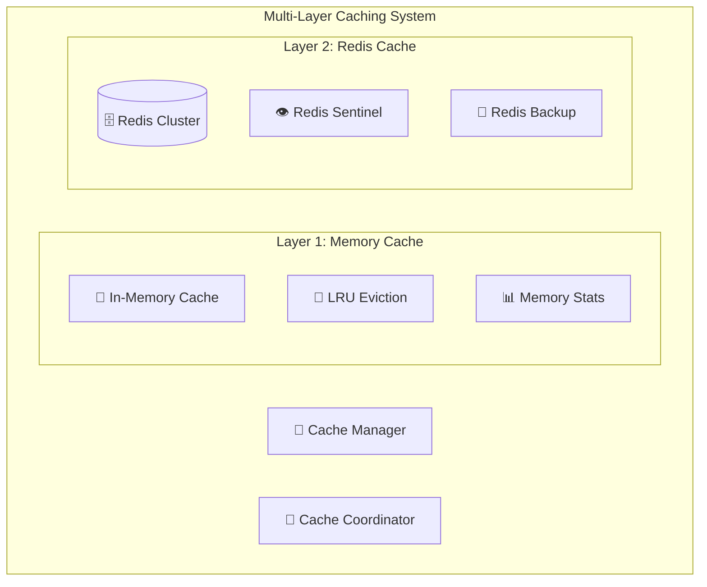

# 🗄️ Caching Strategy - JAEGIS AI Web OS

## 📋 **Overview**

This document outlines the comprehensive caching strategy employed by JAEGIS AI Web OS, including multi-layer caching, cache invalidation policies, and performance optimization techniques.

---

## 🏗️ **Multi-Layer Caching Architecture**

### **Cache Hierarchy**

---

**For complete caching strategy details, see the full documentation in the repository.**