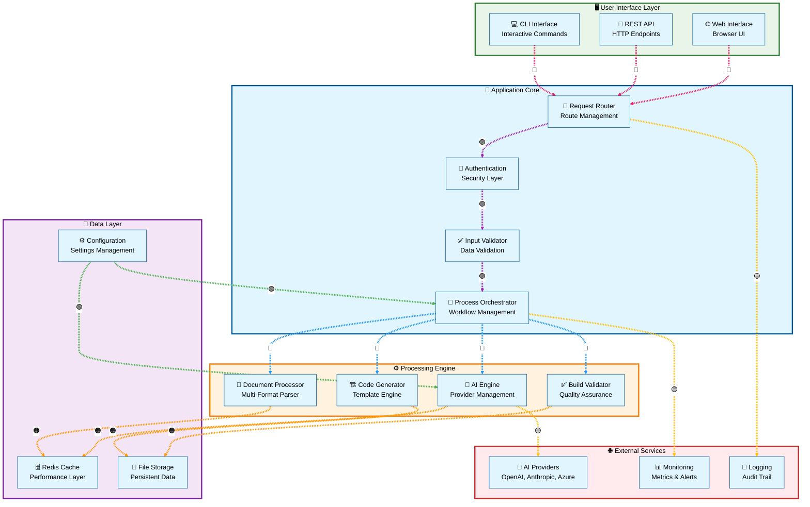
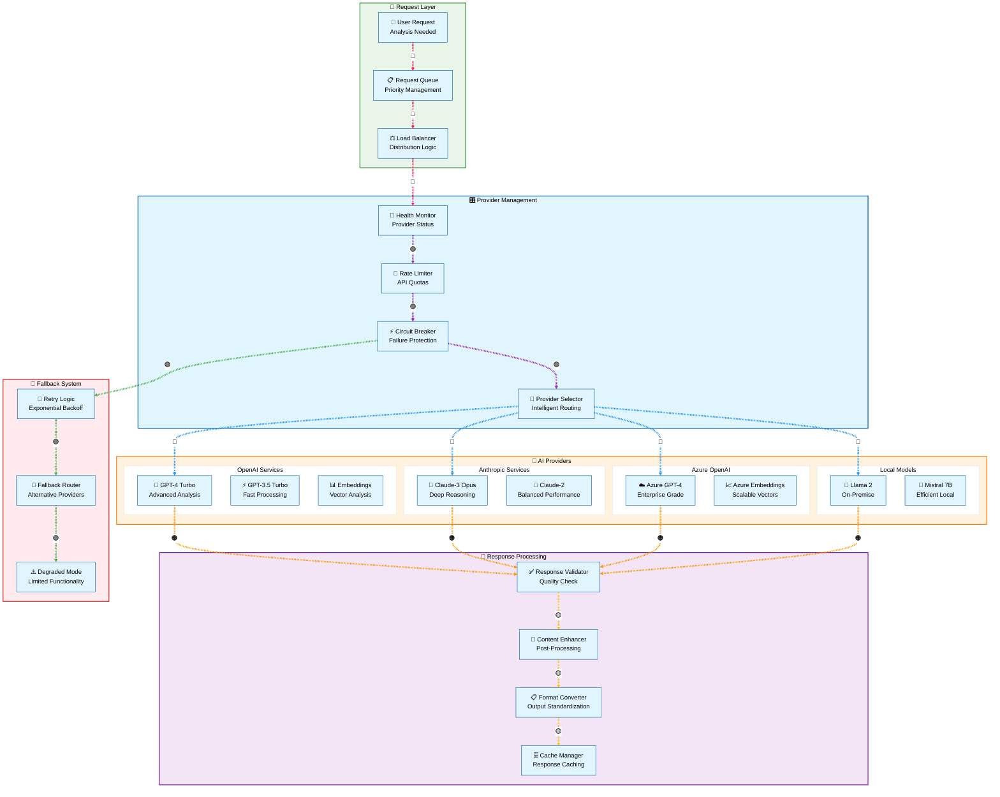
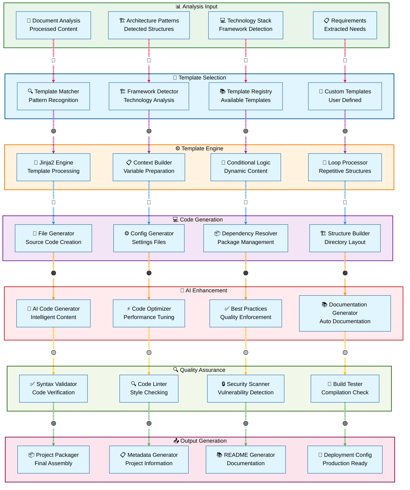
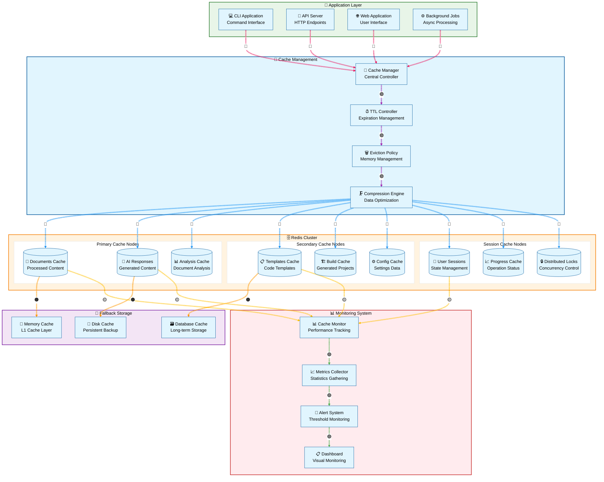
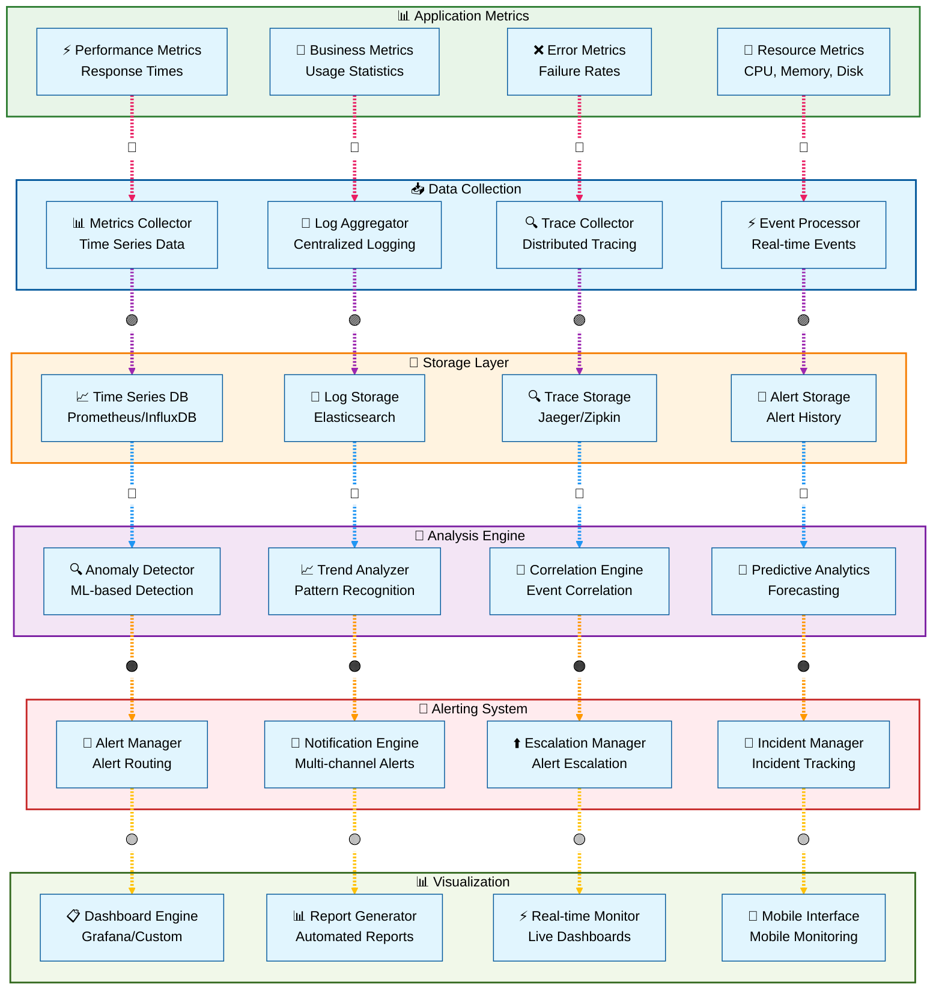
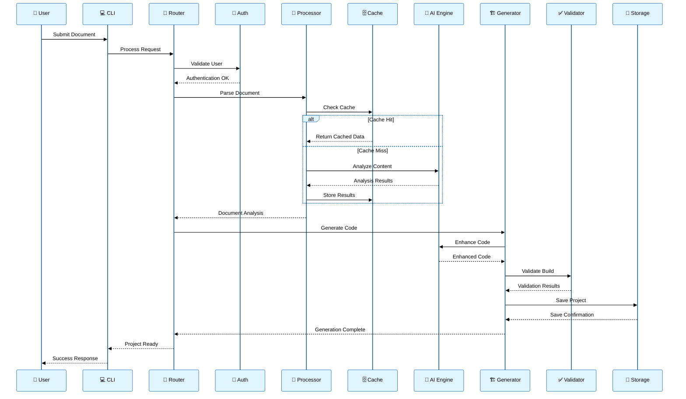
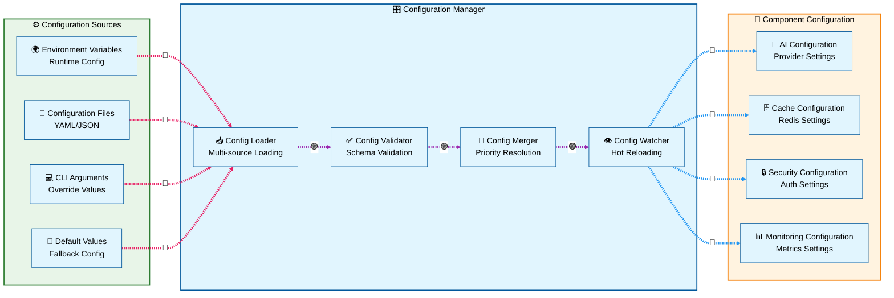

# 🏗️ Component Architecture Diagrams - JAEGIS AI Web OS

## 📋 **Overview**

This document provides detailed component architecture diagrams for JAEGIS AI Web OS, illustrating the relationships, data flows, and interactions between all system components with enhanced accessibility and readability.

---

## 🎯 **Core System Components**

### **High-Level Component Overview**

---

## 📄 **Document Processing Components**

### **Document Processing Pipeline**

```mermaid
%%{init: {'theme':'base', 'themeVariables': {'primaryColor':'#e1f5fe', 'primaryTextColor':'#000', 'primaryBorderColor':'#01579b', 'lineColor':'#ff0066', 'arrowheadColor':'#ff0066', 'edgeLabelBackground':'#ffffff', 'tertiaryColor':'#fff'}}}%%
graph LR
    subgraph InputSources["📥 Input Sources"]
        DOCX["📄 DOCX Files<br/>Microsoft Word"]
        PDF["📋 PDF Files<br/>Portable Documents"]
        PPT["🎯 PowerPoint<br/>Presentations"]
        EXCEL["📊 Excel Files<br/>Spreadsheets"]
        MD["📝 Markdown<br/>Text Files"]
        HTML["🌐 HTML Files<br/>Web Documents"]
    end
    
    subgraph FormatDetection["🔍 Format Detection"]
        DETECTOR["🎯 Format Detector<br/>MIME Type Analysis"]
        VALIDATOR_INPUT["✅ Input Validator<br/>File Verification"]
    end
    
    subgraph SpecializedParsers["🔧 Specialized Parsers"]
        WORD_PARSER["📄 Word Parser<br/>python-docx"]
        PDF_PARSER["📋 PDF Parser<br/>PyPDF2/pdfplumber"]
        PPT_PARSER["🎯 PPT Parser<br/>python-pptx"]
        EXCEL_PARSER["📊 Excel Parser<br/>openpyxl"]
        MD_PARSER["📝 Markdown Parser<br/>markdown"]
        HTML_PARSER["🌐 HTML Parser<br/>BeautifulSoup"]
    end
    
    subgraph ContentProcessing["⚙️ Content Processing"]
        EXTRACTOR["🎯 Content Extractor<br/>Text & Structure"]
        CLEANER["🧹 Content Cleaner<br/>Noise Removal"]
        CHUNKER["🧩 Semantic Chunker<br/>Context Preservation"]
        ENTITY_EXTRACT["🏷️ Entity Extractor<br/>Architecture Elements"]
    end
    
    subgraph OutputGeneration["📤 Output Generation"]
        ANALYZER["📊 Content Analyzer<br/>Pattern Recognition"]
        METADATA["📋 Metadata Generator<br/>Document Properties"]
        CACHE_STORE["🗄️ Cache Storage<br/>Performance Optimization"]
    end
    
    DOCX -.->|"🔴"| DETECTOR
    PDF -.->|"🔴"| DETECTOR
    PPT -.->|"🔴"| DETECTOR
    EXCEL -.->|"🔴"| DETECTOR
    MD -.->|"🔴"| DETECTOR
    HTML -.->|"🔴"| DETECTOR
    
    DETECTOR -.->|"🟣"| VALIDATOR_INPUT
    VALIDATOR_INPUT -.->|"🔵"| WORD_PARSER
    VALIDATOR_INPUT -.->|"🔵"| PDF_PARSER
    VALIDATOR_INPUT -.->|"🔵"| PPT_PARSER
    VALIDATOR_INPUT -.->|"🔵"| EXCEL_PARSER
    VALIDATOR_INPUT -.->|"🔵"| MD_PARSER
    VALIDATOR_INPUT -.->|"🔵"| HTML_PARSER
    
    WORD_PARSER -.->|"🟠"| EXTRACTOR
    PDF_PARSER -.->|"🟠"| EXTRACTOR
    PPT_PARSER -.->|"🟠"| EXTRACTOR
    EXCEL_PARSER -.->|"🟠"| EXTRACTOR
    MD_PARSER -.->|"🟠"| EXTRACTOR
    HTML_PARSER -.->|"🟠"| EXTRACTOR
    
    EXTRACTOR -.->|"🟡"| CLEANER
    CLEANER -.->|"🟡"| CHUNKER
    CHUNKER -.->|"🟡"| ENTITY_EXTRACT
    
    ENTITY_EXTRACT -.->|"🟢"| ANALYZER
    ANALYZER -.->|"🟢"| METADATA
    METADATA -.->|"🟢"| CACHE_STORE
    
    classDef inputStyle fill:#e8f5e8,stroke:#2e7d32,stroke-width:2px,color:#000
    classDef detectionStyle fill:#e1f5fe,stroke:#01579b,stroke-width:2px,color:#000
    classDef parserStyle fill:#fff3e0,stroke:#f57c00,stroke-width:2px,color:#000
    classDef processingStyle fill:#f3e5f5,stroke:#7b1fa2,stroke-width:2px,color:#000
    classDef outputStyle fill:#ffebee,stroke:#c62828,stroke-width:2px,color:#000
    
    class InputSources inputStyle
    class FormatDetection detectionStyle
    class SpecializedParsers parserStyle
    class ContentProcessing processingStyle
    class OutputGeneration outputStyle
    
    linkStyle 0 stroke:#e91e63,stroke-width:4px
    linkStyle 1 stroke:#e91e63,stroke-width:4px
    linkStyle 2 stroke:#e91e63,stroke-width:4px
    linkStyle 3 stroke:#e91e63,stroke-width:4px
    linkStyle 4 stroke:#e91e63,stroke-width:4px
    linkStyle 5 stroke:#e91e63,stroke-width:4px
    linkStyle 6 stroke:#9c27b0,stroke-width:4px
    linkStyle 7 stroke:#2196f3,stroke-width:4px
    linkStyle 8 stroke:#2196f3,stroke-width:4px
    linkStyle 9 stroke:#2196f3,stroke-width:4px
    linkStyle 10 stroke:#2196f3,stroke-width:4px
    linkStyle 11 stroke:#2196f3,stroke-width:4px
    linkStyle 12 stroke:#2196f3,stroke-width:4px
    linkStyle 13 stroke:#ff9800,stroke-width:4px
    linkStyle 14 stroke:#ff9800,stroke-width:4px
    linkStyle 15 stroke:#ff9800,stroke-width:4px
    linkStyle 16 stroke:#ff9800,stroke-width:4px
    linkStyle 17 stroke:#ff9800,stroke-width:4px
    linkStyle 18 stroke:#ff9800,stroke-width:4px
    linkStyle 19 stroke:#ffc107,stroke-width:4px
    linkStyle 20 stroke:#ffc107,stroke-width:4px
    linkStyle 21 stroke:#ffc107,stroke-width:4px
    linkStyle 22 stroke:#4caf50,stroke-width:4px
    linkStyle 23 stroke:#4caf50,stroke-width:4px
    linkStyle 24 stroke:#4caf50,stroke-width:4px
```

---

## 🤖 **AI Integration Components**

### **Multi-Provider AI Architecture**

---

## 🏗️ **Code Generation Components**

### **Template-Based Generation System**

---

## 🗄️ **Caching Architecture Components**

### **Redis-Based Caching System**

---

## 🔒 **Security Components**

### **Security Architecture Overview**

```mermaid
%%{init: {'theme':'base', 'themeVariables': {'primaryColor':'#e1f5fe', 'primaryTextColor':'#000', 'primaryBorderColor':'#01579b', 'lineColor':'#ff0066', 'arrowheadColor':'#ff0066', 'edgeLabelBackground':'#ffffff', 'tertiaryColor':'#fff'}}}%%
graph TB
    subgraph ExternalAccess["🌐 External Access"]
        USERS["👥 Users<br/>CLI, API, Web"]
        EXTERNAL_APIS["🔌 External APIs<br/>AI Providers"]
        MONITORING_TOOLS["📊 Monitoring<br/>External Tools"]
    end
    
    subgraph SecurityGateway["🛡️ Security Gateway"]
        FIREWALL["🔥 Firewall<br/>Network Protection"]
        RATE_LIMITER_SEC["🚦 Rate Limiter<br/>DDoS Protection"]
        IP_WHITELIST["📋 IP Whitelist<br/>Access Control"]
        SSL_TERMINATION["🔒 SSL Termination<br/>TLS 1.3"]
    end
    
    subgraph AuthenticationLayer["🔐 Authentication Layer"]
        AUTH_MANAGER["🔐 Auth Manager<br/>Central Authentication"]
        API_KEY_VALIDATOR["🔑 API Key Validator<br/>Key Verification"]
        JWT_PROCESSOR["🎫 JWT Processor<br/>Token Management"]
        SESSION_MANAGER["👤 Session Manager<br/>State Management"]
    end
    
    subgraph AuthorizationLayer["🛡️ Authorization Layer"]
        RBAC["👥 RBAC System<br/>Role-Based Access"]
        PERMISSION_ENGINE["✅ Permission Engine<br/>Access Control"]
        RESOURCE_GUARD["🛡️ Resource Guard<br/>Data Protection"]
        AUDIT_LOGGER["📝 Audit Logger<br/>Access Tracking"]
    end
    
    subgraph DataProtection["🔒 Data Protection"]
        ENCRYPTION_ENGINE["🔐 Encryption Engine<br/>AES-256"]
        KEY_MANAGER["🔑 Key Manager<br/>Secure Storage"]
        DATA_SANITIZER["🧹 Data Sanitizer<br/>Input Cleaning"]
        SECURE_STORAGE["💾 Secure Storage<br/>Encrypted Data"]
    end
    
    subgraph SecurityMonitoring["👁️ Security Monitoring"]
        INTRUSION_DETECTION["🚨 Intrusion Detection<br/>Threat Monitoring"]
        VULNERABILITY_SCANNER["🔍 Vulnerability Scanner<br/>Security Assessment"]
        SECURITY_ALERTS["🚨 Security Alerts<br/>Incident Response"]
        COMPLIANCE_CHECKER["✅ Compliance Checker<br/>Standards Verification"]
    end
    
    USERS -.->|"🔴"| FIREWALL
    EXTERNAL_APIS -.->|"🔴"| FIREWALL
    MONITORING_TOOLS -.->|"🔴"| FIREWALL
    
    FIREWALL -.->|"🟣"| RATE_LIMITER_SEC
    RATE_LIMITER_SEC -.->|"🟣"| IP_WHITELIST
    IP_WHITELIST -.->|"🟣"| SSL_TERMINATION
    
    SSL_TERMINATION -.->|"🔵"| AUTH_MANAGER
    AUTH_MANAGER -.->|"🔵"| API_KEY_VALIDATOR
    API_KEY_VALIDATOR -.->|"🔵"| JWT_PROCESSOR
    JWT_PROCESSOR -.->|"🔵"| SESSION_MANAGER
    
    SESSION_MANAGER -.->|"🟠"| RBAC
    RBAC -.->|"🟠"| PERMISSION_ENGINE
    PERMISSION_ENGINE -.->|"🟠"| RESOURCE_GUARD
    RESOURCE_GUARD -.->|"🟠"| AUDIT_LOGGER
    
    AUDIT_LOGGER -.->|"🟡"| ENCRYPTION_ENGINE
    ENCRYPTION_ENGINE -.->|"🟡"| KEY_MANAGER
    KEY_MANAGER -.->|"🟡"| DATA_SANITIZER
    DATA_SANITIZER -.->|"🟡"| SECURE_STORAGE
    
    SECURE_STORAGE -.->|"🟢"| INTRUSION_DETECTION
    INTRUSION_DETECTION -.->|"🟢"| VULNERABILITY_SCANNER
    VULNERABILITY_SCANNER -.->|"🟢"| SECURITY_ALERTS
    SECURITY_ALERTS -.->|"🟢"| COMPLIANCE_CHECKER
    
    classDef externalStyle fill:#e8f5e8,stroke:#2e7d32,stroke-width:2px,color:#000
    classDef gatewayStyle fill:#e1f5fe,stroke:#01579b,stroke-width:2px,color:#000
    classDef authStyle fill:#fff3e0,stroke:#f57c00,stroke-width:2px,color:#000
    classDef authzStyle fill:#f3e5f5,stroke:#7b1fa2,stroke-width:2px,color:#000
    classDef protectionStyle fill:#ffebee,stroke:#c62828,stroke-width:2px,color:#000
    classDef monitoringStyle fill:#f1f8e9,stroke:#33691e,stroke-width:2px,color:#000
    
    class ExternalAccess externalStyle
    class SecurityGateway gatewayStyle
    class AuthenticationLayer authStyle
    class AuthorizationLayer authzStyle
    class DataProtection protectionStyle
    class SecurityMonitoring monitoringStyle
    
    linkStyle 0 stroke:#e91e63,stroke-width:4px
    linkStyle 1 stroke:#e91e63,stroke-width:4px
    linkStyle 2 stroke:#e91e63,stroke-width:4px
    linkStyle 3 stroke:#9c27b0,stroke-width:4px
    linkStyle 4 stroke:#9c27b0,stroke-width:4px
    linkStyle 5 stroke:#9c27b0,stroke-width:4px
    linkStyle 6 stroke:#2196f3,stroke-width:4px
    linkStyle 7 stroke:#2196f3,stroke-width:4px
    linkStyle 8 stroke:#2196f3,stroke-width:4px
    linkStyle 9 stroke:#2196f3,stroke-width:4px
    linkStyle 10 stroke:#ff9800,stroke-width:4px
    linkStyle 11 stroke:#ff9800,stroke-width:4px
    linkStyle 12 stroke:#ff9800,stroke-width:4px
    linkStyle 13 stroke:#ff9800,stroke-width:4px
    linkStyle 14 stroke:#ffc107,stroke-width:4px
    linkStyle 15 stroke:#ffc107,stroke-width:4px
    linkStyle 16 stroke:#ffc107,stroke-width:4px
    linkStyle 17 stroke:#ffc107,stroke-width:4px
    linkStyle 18 stroke:#4caf50,stroke-width:4px
    linkStyle 19 stroke:#4caf50,stroke-width:4px
    linkStyle 20 stroke:#4caf50,stroke-width:4px
    linkStyle 21 stroke:#4caf50,stroke-width:4px
```

---

## 📊 **Monitoring and Observability Components**

### **Comprehensive Monitoring Architecture**

---

## 🎯 **Component Interaction Patterns**

### **Request-Response Flow**

---

## 📋 **Component Dependencies**

### **Dependency Matrix**

| Component | Dependencies | Provides |
|-----------|-------------|----------|
| **CLI Interface** | Router, Auth | User Commands |
| **REST API** | Router, Auth, Validator | HTTP Endpoints |
| **Request Router** | Auth, Orchestrator | Request Routing |
| **Authentication** | Config, Session Manager | Security Layer |
| **Document Processor** | Cache, AI Engine | Content Analysis |
| **AI Engine** | Provider APIs, Cache | Intelligence Layer |
| **Code Generator** | Templates, AI Engine | Project Generation |
| **Build Validator** | Storage, External Tools | Quality Assurance |
| **Redis Cache** | Redis Cluster | Performance Layer |
| **File Storage** | File System | Data Persistence |
| **Monitoring** | Metrics Collector | Observability |

---

## 🔧 **Component Configuration**

### **Configuration Dependencies**

---

**These component diagrams provide a comprehensive view of the JAEGIS AI Web OS architecture with enhanced accessibility, proper contrast ratios, and clear component relationships for enterprise-grade system understanding.**