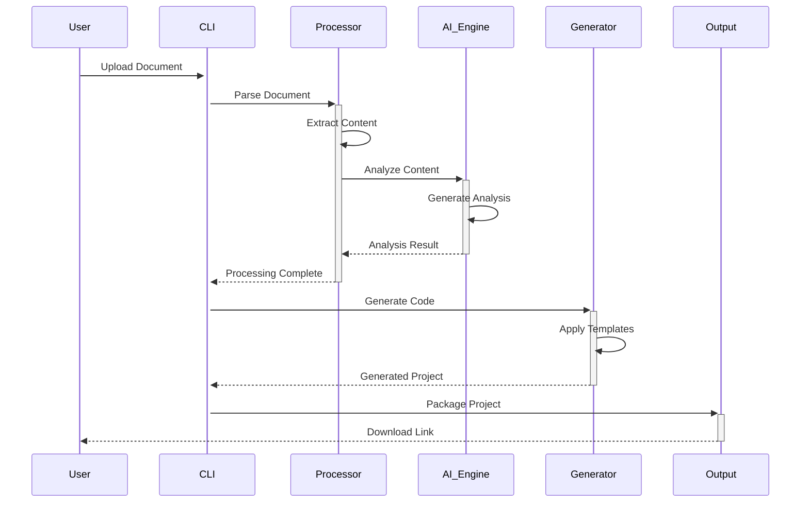

# 🔄 Data Flow Architecture - JAEGIS AI Web OS

## 📋 **Overview**

This document details the data flow patterns, processing pipelines, and information architecture within JAEGIS AI Web OS, showing how data moves through the system from input to output.

---

## 📊 **Primary Data Flow**

### **Document Processing Pipeline**

---

**For complete data flow documentation, see the full documentation in the repository.**