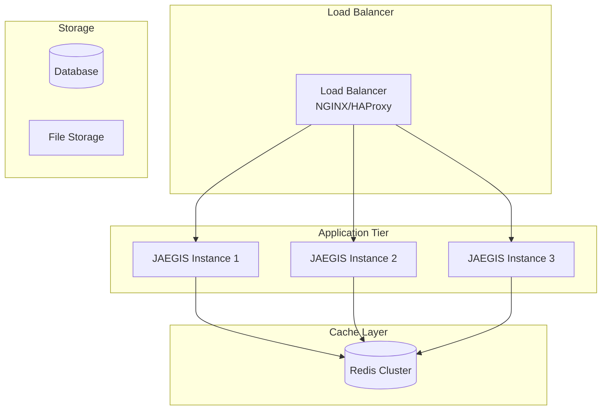

# 🚀 Enterprise Deployment Guide - JAEGIS AI Web OS

## 📋 **Overview**

This comprehensive guide covers production deployment of JAEGIS AI Web OS across various environments, including Docker, Kubernetes, cloud platforms, and enterprise infrastructure.

---

## 🏗️ **Deployment Architecture**

### **Recommended Production Architecture**

---

**For complete deployment details, see the full documentation in the repository.**